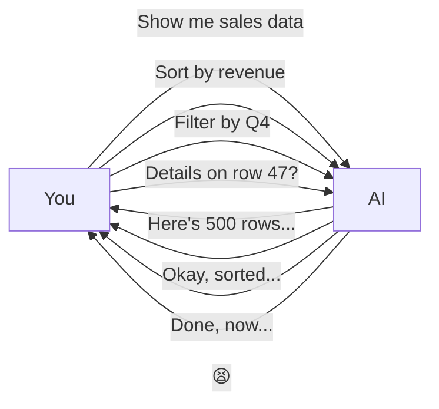
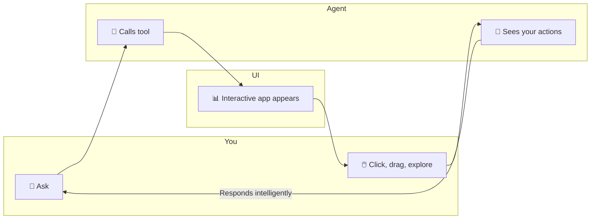
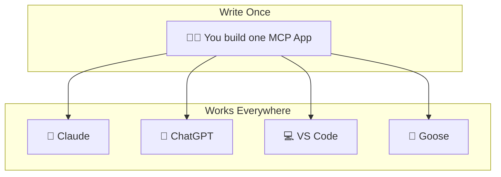

# 🎯 MCP Apps: Interactive UI in AI Conversations

Harald Kirschner
---

## 😤 The Problem

**MCP Apps:** Skip the ping-pong. Get an interactive dashboard. ✨

---

## 🧩 What Are MCP Apps?

- 🏆 First official Model Context Protocol extension
- 🖼️ Tools return interactive UI components in sandboxed iframes
- 🔄 Model stays in the loop, sees what users do
- 🌐 One codebase → Claude, ChatGPT, VS Code, Goose

---

## 💡 Real Use Cases

**🚩 Feature Flags**
Scrolling through flag lists → Multi-select picker with environment tabs, tag filters, generates SDK hooks

**🔥 Performance Analysis**
Text summaries of profiles → Interactive flame graphs with click-to-zoom, hot path analysis sent to chat

**📋 List Prioritization**
Back-and-forth reordering → Drag-and-drop UI, save order or ask AI to sort

---

## ⚙️ How It Works

**The loop:** You act → Agent sees → Agent helps

---

## 🔒 Security Model

1. 🛡️ Iframe sandboxing with restricted permissions
2. 📝 Pre-declared templates reviewed before render
3. 📊 Auditable JSON-RPC messages
4. ✅ User consent for UI-initiated tool calls

---

## 🚀 Get Started

https://github.com/modelcontextprotocol/ext-apps

https://code.visualstudio.com/blogs/2026/01/26/mcp-apps-support

📚 Docs: modelcontextprotocol.io/docs/extensions/apps
🤖 Agent docs: mcp-apps skill!

---

## 🔮 The Vision

**Sometimes showing is better than telling—now agents can do both.** 🎤